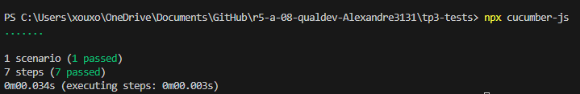

= R5.A.08 -- Dépôt pour les TPs
:icons: font
:MoSCoW: https://fr.wikipedia.org/wiki/M%C3%A9thode_MoSCoW[MoSCoW]

Ce dépôt concerne les rendus de mailto:alexandre.benachir@etu.univ-tlse2.fr[Alexandre Benachir].

== TP1

.is_it_friday_yet.feature
[source,gherkin]
Feature: Is it Friday yet?
Everybody wants to know when it's Friday
Scenario Outline: Sunday isn't Friday
    Given today is <day>
    When I ask whether it's <day> yet
    Then I should be told "<answer>"
    Examples:
    | day            | answer |
    | Friday         | TGIF   |
    | Sunday         | Nope   |
    | anything else! | Nope   |

.Tests d'éxecution
image::tests.PNG[width=80%]

== TP2
.Order.java (dans CocktailSteps.java)
[source,java]
    class Order {
        private static String owner;
        private static String target;
        private static List<String> cocktails = new ArrayList<String>();
        static void declareOwner(String newOwner) {
            owner = newOwner;
        }
        static void declareTarget(String newTarget) {
            target = newTarget;
        }
        static List<String> getCocktails() {
            return cocktails;
        }
    }

.Tests d'éxecution
image::tests2.PNG[width=80%]

== TP3
.applyJob.feature
[source,gherkin]
    Feature: Candidater pour un travail
    Scenario: Candidater pour une offre d'emploi
        Given l'utilisateur "Dupont" existe
        And l'utilisateur "Martin" existe
        When l'utilisateur "Dupont" remplit le formulaire de candidature avec les informations suivantes:
        | champ   | valeur               |
        | nom     | Dupont               |
        | email   | dupont@example.com   |
        | cv      | cv_dupont.pdf        |
        And l'utilisateur "Dupont" envoie sa candidature à "Martin"
        Then un message de confirmation devrait être affiché avec le texte "Votre candidature a été envoyée avec succès."
        And l'historique des messages de "Dupont" devrait contenir un message envoyé à "Martin" avec le texte "Candidature envoyée par Dupont"
        And l'historique des messages de "Martin" devrait être vide

.applyJobStepsDefinition.js
[source,javascript]
    import { Given, When, Then } from '@cucumber/cucumber';
    import User from '../User.js';
    let user1;
    let user2;
    Given('l\'utilisateur {string} existe', function (nom) {
    const email = `${nom.toLowerCase()}@example.com`;
    if (nom === "Dupont") {
        user1 = new User(nom, email);
    } else if (nom === "Martin") {
        user2 = new User(nom, email);
    }
    });
    When('l\'utilisateur {string} remplit le formulaire de candidature avec les informations suivantes:', function (nom, table) {
    const user = nom === "Dupont" ? user1 : user2;
    const data = table.rowsHash();
    user.candidature = {
        nom: data.nom,
        email: data.email,
        cv: data.cv
    };
    });
    When('l\'utilisateur {string} envoie sa candidature à {string}', function (nom1, nom2) {
    const sender = nom1 === "Dupont" ? user1 : user2;
    const receiver = nom2 === "Dupont" ? user1 : user2;
    sender.send(receiver, "Candidature envoyée par " + sender.nom);
    });
    Then('un message de confirmation devrait être affiché avec le texte {string}', function (message) {
    if (message !== "Votre candidature a été envoyée avec succès.") {
        throw new Error(`Le message de confirmation attendu est incorrect : ${message}`);
    }
    });
    Then('l\'historique des messages de {string} devrait contenir un message envoyé à {string} avec le texte {string}', function (nom1, nom2, message) {
    const sender = nom1 === "Dupont" ? user1 : user2;
    const expectedMessage = { to: nom2, message };
    const messagesEnvoyes = sender.getMessagesEnvoyes();
    const messageFound = messagesEnvoyes.some(msg => msg.to === nom2 && msg.message === message);
    if (!messageFound) {
        throw new Error(`Le message envoyé de ${nom1} à ${nom2} avec le texte "${message}" n'a pas été trouvé.`);
    }
    });
    Then('l\'historique des messages de {string} devrait être vide', function (nom) {
    const receiver = nom === "Dupont" ? user1 : user2;
    const messagesEnvoyes = receiver.getMessagesEnvoyes();
    if (messagesEnvoyes.length > 0) {
        throw new Error(`L'historique des messages de ${nom} ne devrait pas contenir de messages.`);
    }
    });

.Objectifs des tests 
Mon but en faisant ces tests sur la candidature aux jobs, c’était surtout de vérifier que tout marche comme prévu. 
Je voulais m’assurer que quand un utilisateur remplit le formulaire et envoie sa candidature, tout se passe bien, que les infos comme le nom, l’email et le CV arrivent au bon endroit, et que le message de confirmation s’affiche correctement. 
Ça m’a aussi permis de voir si l’interaction entre les utilisateurs fonctionne sans bug.

.Tests d'éxecution

== TP4
.Documentation hellocucumber

Dans le fichier :
====
include::hellocucumber/report.txt[]
====
[source, shell]
----
Scenario Outline: Sunday isn't Friday        # hellocucumber/is_it_friday_yet.feature:13
  Given today is anything else!              # hellocucumber.StepDefinitions.today_is_anything_else()
  When I ask whether it's anything else! yet # hellocucumber.StepDefinitions.i_ask_whether_it_s_anything_else_yet()
  Then I should be told "Nope"               # hellocucumber.StepDefinitions.i_should_be_told(java.lang.String)
[INFO] Tests run: 4, Failures: 0, Errors: 0, Skipped: 0, Time elapsed: 0.102 s -- in hellocucumber.RunCucumberTest
[INFO] 
[INFO] Results:
[INFO] 
[INFO] Tests run: 4, Failures: 0, Errors: 0, Skipped: 0
[INFO] 
[INFO] ------------------------------------------------------------------------
[INFO] BUILD SUCCESS
[INFO] ------------------------------------------------------------------------
[INFO] Total time:  1.124 s
[INFO] Finished at: 2024-12-12T08:20:52+01:00
[INFO] ------------------------------------------------------------------------
----

Dans le fichier :
====
include::hellocucumber/target/cukedoctor/documentation.html[]
====
[source, html]