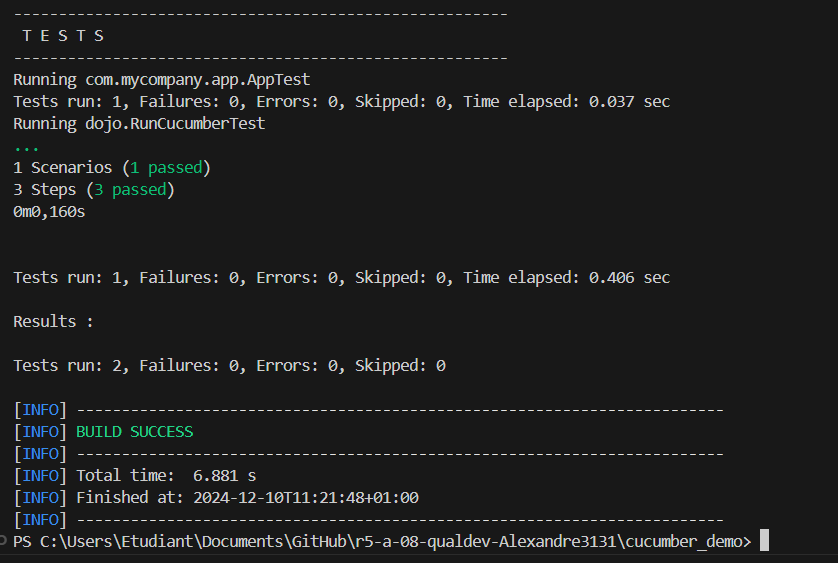

= R5.A.08 -- Dépôt pour les TPs
:icons: font
:MoSCoW: https://fr.wikipedia.org/wiki/M%C3%A9thode_MoSCoW[MoSCoW]

Ce dépôt concerne les rendus de mailto:alexandre.benachir@etu.univ-tlse2.fr[Alexandre Benachir].

== TP1

.is_it_friday_yet.feature
[source,feature]
Feature: Is it Friday yet?
Everybody wants to know when it's Friday
Scenario Outline: Sunday isn't Friday
    Given today is <day>
    When I ask whether it's <day> yet
    Then I should be told "<answer>"
    Examples:
    | day            | answer |
    | Friday         | TGIF   |
    | Sunday         | Nope   |
    | anything else! | Nope   |

.Tests d'éxecution
image::tests.PNG[width=80%]

== TP2
.Order.java (dans CocktailSteps.java)
[source,java]
    class Order {
        private static String owner;
        private static String target;
        private static List<String> cocktails = new ArrayList<String>();
        static void declareOwner(String newOwner) {
            owner = newOwner;
        }
        static void declareTarget(String newTarget) {
            target = newTarget;
        }
        static List<String> getCocktails() {
            return cocktails;
        }
    }

.Tests d'éxecution

== TP2
